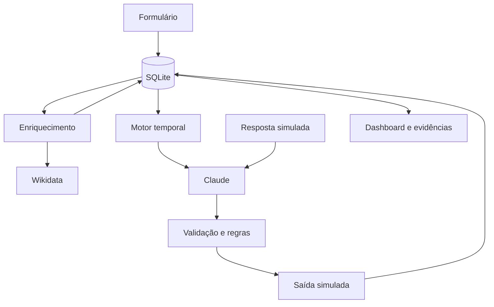

# Documentação técnica — Vigil.AI, versão 2

Autor da entrega: Jocélio de Souza Santos. Referência: case AI Engineer, anexo do MBA AI Leader. Aplicação: https://vigil-ai-mvp.streamlit.app/.

## 1. Problema e arquitetura

O objetivo é converter inscrições B2B em presença qualificada e reuniões comerciais. O público do case é formado por CISOs, CTOs, diretores de TI e gestores de risco de empresas com **mais de 200 funcionários**, para evento de 120 participantes. A meta é **comparecimento acima de 70%**; confirmação é um indicador intermediário. O dashboard usa inscritos como denominador de confirmados, presentes e reuniões; percentuais de personas não comprovam resultado comercial.

- **Entrada/captação:** formulário Streamlit com nome, e-mail validado, cargo, empresa, setor, porte, LinkedIn opcional e interesse. Formulário foi escolhido pela baixa barreira de acesso e pela possibilidade de declarar finalidade antes de coletar contatos de executivos. Integração com LinkedIn adicionaria dependência e verificação de permissões.
- **Enriquecimento:** `enrichment.py` distingue origem declarada, persona sintética e informação pública da empresa. Nada é inferido como vínculo profissional verificado.
- **Processamento/LLM:** Claude classifica respostas com histórico/fase e escolhe um tema entre dados presentes. JSON é validado. Textos factuais são construídos por templates controlados, evitando cases, vagas e horários inventados.
- **Regras:** `db.py` possui transições específicas; `workflow.py` decide janelas, elegibilidade e deduplicação. O modelo não grava diretamente no banco nem determina consentimento.
- **Canal:** caixa de saída WhatsApp simulada em `interactions`. Nenhuma chamada de envio externo.
- **Conversão:** presença e interesse observados entram pela interface; uma intenção de reunião habilita registro manual de data futura com fuso. Não há convite ou verificação de disponibilidade em calendário externo.
- **Infraestrutura:** Streamlit Community Cloud para demonstração. Worker local em thread compartilhada pelo processo; alternativa executável `python workflow.py` para host supervisionado. O worker precisa de processo ativo e banco compartilhado/persistente.

### Modelo de dados

`schema.sql` é a fonte do DDL; `db.py` aplica migração transacional versionada. Tabelas:

| Tabela | Conteúdo |
|---|---|
| leads | Perfil, estado comercial, flags de confirmação/presença/reunião, consentimento/origem sintética, supressão independente, revisão pendente e proveniência. |
| interactions | Mensagem, fase, direção, canal, intenção e timestamp. |
| agent_actions | Ação, razão e payload auditável. |
| deliveries | Uma reserva por lead + evento + etapa; status, tentativas, falha e timestamp. |
| settings | Data do evento, habilitação do worker e contador diário de chamadas de IA. |

Chaves estrangeiras são ativadas por conexão. A migração conserva dados legados e adiciona as relações ausentes; inconsistências de integridade provocam rollback, não exclusão silenciosa. A migração inicial não reclassifica um resumo antigo como enriquecimento público: nova análise é necessária.

O estado comercial é separado de `suppressed`: reanálise e presença não removem opt-out. Recusa pré-evento zera confirmação. Reunião e opt-out não são reabertos por enriquecimento. Respostas incertas pausam a régua até uma nova resposta esclarecedora. O histórico e as ações podem ser baixados em JSON na aba Evidências.

## 2. Stack e justificativas

| Componente | Escolha e motivo |
|---|---|
| LLM | Anthropic Claude, modelo padrão `claude-sonnet-4-5`, configurável. Atende à preferência do case; usado para interpretação contextual e seleção de tema. |
| SDK | Anthropic nativo; evita abstração extra no MVP e facilita auditar os prompts completos em agent.py. |
| Parâmetros | Temperatura 0 para tarefas estruturadas; até 200 tokens para intenção e 80 para seleção de tema. Objetivo: reduzir variação, custo e tamanho de saída. Isso não garante acerto; schema e confiança são verificados. |
| Banco | SQLite + SQLAlchemy. Simples para demonstração, com transações e chaves estrangeiras. Apenas SQLite está implementado. |
| Workflow | Python, worker de um minuto e relógio controlado para avaliar regras temporais. Reserva única no banco evita duplicações persistidas. |
| Canal | WhatsApp pela natureza curta de confirmação e follow-up; integração é simulada. E-mail de fallback é uma extensão futura, não funcionalidade entregue. |
| Interface/deploy | Streamlit, unindo formulário, conversas, dashboard e evidências. Cache de recurso mantém um worker por processo; a disponibilidade depende do host. |
| Fonte pública | Wikidata com identificador selecionado e conferido pelo operador. Evita matching silencioso entre empresas de nome semelhante. Sem scraping de perfis privados. |

## 3. Réguas implementadas

Início do evento configurável como ISO 8601 com fuso. O modelo temporal assume **duração de oito horas**: T0 vale do início até +8 h; D0 começa após +8 h. Para outro formato, a duração deve tornar-se configurável. Não há alegação de logística real do evento além dos dados configurados.

A cada execução considera-se **somente a janela atual**: não são disparados todos os contatos atrasados de uma vez. Uma etapa concluída não se repete no mesmo evento. Testes com relógio fictício usam namespace DEMO e apenas personas sintéticas; worker real usa LIVE.

### Pré-evento

| Janela relativa ao início | Elegibilidade | Objetivo |
|---|---|---|
| T-14 até antes de T-7 | Ainda não confirmou | Convite e tema relacionado ao perfil. |
| T-7 até antes de T-3 | Ainda não confirmou | Reforço de relevância e confirmação. |
| T-3 até antes de T-1 | Ainda não confirmou | Último pedido de confirmação antes do lembrete. |
| T-1 até início | Confirmado ou pendente | Confirmado recebe lembrete sem novo pedido; pendente recebe CTA de confirmação. |
| Início até +8 h | Não marcado presente | Lembrete de evento; não inventa local/agenda. |

Recusa, opt-out, ausência de consentimento/enriquecimento, revisão pendente e reunião bloqueiam as ações correspondentes. Empresas com porte exatamente 200 não ganham pontos de ICP; o case diz “mais de 200”.

Exemplo sintético: “Olá, Mariana Demo! Convite para o Vigil Summit, evento B2B sobre segurança cibernética. Considerando Atlas Bank (fictícia), podemos conversar sobre SOC 2. Você confirma presença no Vigil Summit?”

### Pós-evento

| Janela | Regra |
|---|---|
| +8 h até D+1 | D0: agradecimento para presentes. |
| D+1 até D+3 | Follow-up personalizado; ausentes recebem mensagem de ausência, sem afirmar que assistiram a uma demo. |
| D+3 até D+7 | Convite para conversa de 25 minutos. |
| D+7 até D+8 | Último contato, explicitamente identificado como tal. |
| A partir de D+8 | Nenhuma nova mensagem desta régua. |

Interesse de reunião move para FOLLOW_UP_QUENTE. Registro manual de reunião encerra contatos. Recusa explícita não é tratada como simples no-show. Opt-out bloqueia qualquer fase, antes da chamada de geração e novamente antes da persistência.

Exemplo sintético: “Olá, Mariana Demo! Obrigado por participar do Vigil Summit. Seu interesse registrado é SOC 2. Vamos explorar esse tema no contexto de Atlas Bank (fictícia)? Podemos combinar uma conversa de 25 minutos?”

### Falhas e limites

Reserva em `deliveries` impede duas execuções de registrarem a mesma etapa. Falhas têm até três tentativas, com intervalo mínimo de cinco minutos; uma reserva interrompida pode ser retomada após esse intervalo. Geração e gravação rechecadas evitam saída após opt-out concorrente. Esse contrato é para **persistência simulada**; um adaptador real precisaria também de idempotência do provedor. Há limite de 12 mensagens por lead/dia e orçamento global configurável de 200 chamadas ao cliente LLM por dia (o SDK pode tentar novamente dentro de uma chamada). Não são garantias de controle financeiro do provedor.

## 4. Dados, enriquecimento e privacidade

Coleta mínima por formulário. O cadastro público padrão é sintético (`DEMO_MODE=true`) e só aceita domínios de teste. A origem do consentimento é `synthetic_demo`, não um consentimento de pessoa real. Dados reais exigem configuração explícita e senha de avaliação; senha compartilhada não substitui autenticação e autorização por usuário.

Na consulta pública, o operador escolhe um QID, examina a entidade e confirma que corresponde à empresa. São guardados descrição, sites oficiais informados pela fonte, URL, data e escopo. A consulta usa host fixo, timeout e limite de bytes; não aceita uma URL arbitrária. Fonte indisponível não é substituída por informação inventada. A descrição externa participa do contexto e é atribuída na mensagem quando presente. Cargo, vínculo, porte e interesse do indivíduo não são comprovados por essa fonte e permanecem declarados. A cobertura pública é propositalmente restrita à organização; fontes adicionais seriam necessárias para validar cargo e demais sinais pessoais do case.

Claude recebe histórico recente e os dados necessários à tarefa. As instruções distinguem dados de comandos; a saída livre não é usada para criar afirmações factuais sobre clientes, cases, logística ou resultados. Índice de tema inválido interrompe geração; classificação inválida/indisponível guarda a resposta e pausa a régua. Confiança abaixo de 0,8 não confirma nem converte automaticamente.

Medidas técnicas: finalidade no formulário, marcação de origem/consentimento, supressão persistente, controles de entrada, escape HTML, limitação de chamadas e anonimização do perfil e conteúdo dos históricos. A função de anonimização é explícita e irreversível; não a executar para “limpar” testes sem necessidade. Mantém contagens anônimas. Retenção automatizada, autenticação individual, backups, contratos de operadores e avaliação jurídica de base legal são necessários para uso real; não se declara conformidade jurídica integral do MVP.

## 5. Três decisões e alternativas

1. **LLM limitado a decisões linguísticas estruturadas.** Templates e regras controlam os fatos e o estado. A auditoria encontrou uma afirmação de “cases práticos” não sustentada. Em vez de confiar só em um pedido no prompt, retirou-se do modelo a geração livre dessas alegações. Alternativa descartada: agente com escrita irrestrita no banco.
2. **Réguas próprias e canal simulado.** Torna os gatilhos e estados verificáveis com relógio controlado e evita contatar terceiros durante avaliação. Alternativas: integração imediata WhatsApp/Twilio e workflow n8n completo; acrescentariam credenciais e configuração de provedores. Simulação é declarada, não equivalente a implantação de canal real.
3. **Arquitetura pequena com proveniência explícita.** SQLite, SDK nativo e Wikidata por entidade conferida mantêm rastreabilidade. Multiagentes/CrewAI e RAG foram descartados por não haver coordenação de papéis ou corpus documental que justificassem a complexidade. Migração PostgreSQL é trabalho futuro com driver, DDL, testes e armazenamento, não troca trivial de URL.

Referências consultadas na revisão de 17/09/2026:

- [Anthropic: prompt engineering](https://platform.claude.com/docs/en/build-with-claude/prompt-engineering/overview): critérios de sucesso e avaliações empíricas sustentam testes e saídas verificadas; não provam eficácia comercial.
- [SQLAlchemy: SQLite e foreign keys](https://docs.sqlalchemy.org/en/20/dialects/sqlite.html#foreign-key-support): suporte e configuração de integridade usados na migração.
- [Wikidata: Data access](https://www.wikidata.org/wiki/Wikidata:Data_access): acesso a entidade conhecida, proveniência e cuidado com erros/limites de fonte.
- [Streamlit: cache_resource](https://docs.streamlit.io/develop/api-reference/caching-and-state/st.cache_resource): recurso compartilhado pelo processo; fundamenta o ciclo do worker e necessidade de segurança em concorrência.
- [Streamlit: app settings](https://docs.streamlit.io/deploy/streamlit-community-cloud/manage-your-app/app-settings): configuração de Secrets para credenciais fora do código.

## 6. Plano dos primeiros cinco dias

| Dia | 2–3 atividades principais | Entregável e motivo da ordem |
|---|---|---|
| 1 | Definir funil/consentimento; criar schema; cadastrar personas | Banco e contratos antes do LLM: permitem testar gravação e impedir estado inconsistente. |
| 2 | Configurar chave protegida; integrar/classificar com Claude; separar proveniência | Agente mínimo e dados rastreáveis antes de mensagens. |
| 3 | Construir pré-evento; deduplicar etapas; testar confirmação/recusa/opt-out | Régua de presença com regras protegidas. |
| 4 | Registrar contexto; construir follow-up; validar reunião e no-show | Percurso até conversão demonstrável. |
| 5 | Testar ponta a ponta; publicar; revisar documentação/evidências | Aplicação testável e continuidade técnica. |

## 7. Bônus: dez eventos simultâneos

Adicionar `events` e `event_leads`; separar pessoa, inscrição e contexto por evento; escopar todas as consultas e permissões por organização/evento. Regras, datas, fontes e temas tornam-se configuração versionada por setor. Migrar para PostgreSQL com migrations testadas, filas/worker supervisionado, locks e chaves de idempotência por evento/lead/etapa. Isolar prompts e métricas para manufatura, saúde, financeiro e governo. Adaptadores de canal/calendário devem confirmar entrega e reservar horários com idempotência externa. O núcleo de elegibilidade e classificação permanece, mas não se afirma que o MVP já oferece multi-tenant.

## 8. Acesso, prova e limitações

Siga README e DEMO_SCRIPT. Aba Evidências apresenta fonte, conversas, ações e etapas e permite exportar JSON. `schema.sql` e testes públicos permitem inspecionar estrutura e comportamento. Código do modelo/configuração fica em agent.py/.env.example; nunca envie chaves à banca.

A aplicação deve estar acessível e a API ativa durante avaliação. Worker não sobrevive à suspensão do host. SQLite local exige política de persistência e backup para operação real. Exportar evidências antes de reinícios é prudente, mas exportação individual não é restauração completa. Não há canal real, agenda real, verificação de cargo ou de vínculo, integração low-code ou benefício comercial medido.
